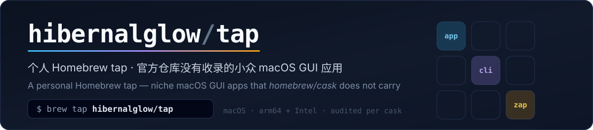
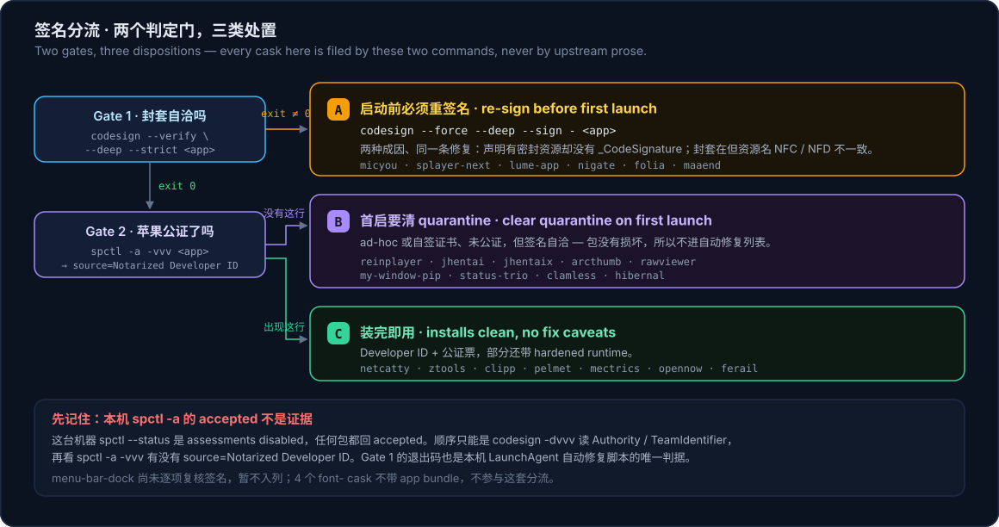

<div align="center">



[简体中文](README.md) · **English**

[](https://github.com/HibernalGlow/homebrew-tap/actions/workflows/tests.yml)


</div>

A personal Homebrew tap for niche macOS GUI apps that the official repository (`homebrew/cask`) does not carry.

Think of it as the macOS counterpart to a self-hosted Scoop bucket on Windows: upstream ships a proper GitHub Release with stable artifact names, but nobody ever packaged it — so it lives here.

Repository: <https://github.com/HibernalGlow/homebrew-tap>

> [!NOTE]
> This file is the English mirror of [README.md](README.md) (the primary document). Both are kept in sync by hand, including the tables below.

---

## Contents

- [Install the tap](#install-the-tap)
- [Install software](#install-software)
- [What this tap carries](#what-this-tap-carries)
- [Signature and notarization](#signature-and-notarization)
- [Repository layout](#repository-layout)
- [Adding a new cask](#adding-a-new-cask)
- [Bumping versions](#bumping-versions)
- [Testing locally](#testing-locally)
- [What CI checks](#what-ci-checks)
- [Growing the tap](#growing-the-tap)
- [Known upstream defects](#known-upstream-defects)
- [Per-cask notes](#per-cask-notes)

---

## Install the tap

```sh
brew tap hibernalglow/tap
```

> [!NOTE]
> The GitHub owner is `HibernalGlow` (capitalised), but Homebrew normalises tap names to lowercase, and the clone path is lowercase too (`/opt/homebrew/Library/Taps/hibernalglow/homebrew-tap`). Writing `HibernalGlow/tap` installs fine as well; the canonical internal form is `hibernalglow/tap`.

Homebrew 7 no longer loads casks or formulae from third-party taps by default, so the first `install` prompts for trust. To authorise it up front:

```sh
brew trust hibernalglow/tap
```

## Install software

```sh
brew install --cask splayer-next
```

You can also skip the `tap` step entirely:

```sh
brew install --cask hibernalglow/tap/splayer-next
```

In a `Brewfile`:

```ruby
tap "hibernalglow/tap"
cask "splayer-next"
```

Uninstalling (`--zap` also clears the app's data):

```sh
brew uninstall --cask --zap splayer-next
```

## What this tap carries

The **Fix** column says what you still have to do after installing. The criteria are in [Signature and notarization](#signature-and-notarization).

### Application casks

| Cask | Version | Fix | Arch · macOS | Upstream | Notes |
| --- | --- | :-: | --- | --- | --- |
| [`arcthumb`](#arcthumb) | 0.12.0 | **B** | arm64 / intel · `:macos` | [HibernalGlow/ArcThumbX](https://github.com/HibernalGlow/ArcThumbX) | Quick Look thumbnail extension for archive and ebook covers (Rust + Slint); the same binary doubles as a CLI (`arcthumb --get` / `--regenerate`). **Installing is not enough** — it must be registered with `pluginkit` |
| [`clamless`](#clamless) | 0.1.10 | **B** | arm64 only · `:tahoe` | [TCXM/clamless](https://github.com/TCXM/clamless) | Disconnects the MacBook built-in display without closing the lid (native Swift menu bar app) via private SkyLight / IOMobileFramebuffer APIs. Upstream claims macOS 13+, the artifact is `minos 26.0` — this cask states the true value, which makes the `brew audit` min_os check fail on purpose |
| [`clipp`](#clipp) | 1.5.0.160 | **C** | arm64 only · `:sonoma` | [martona/clipp](https://github.com/martona/clipp) | Peer-to-peer clipboard sync over the LAN (text / images); the same binary doubles as `clipp copy` / `paste`. Upstream ships its own tap (`martona/tap`); this one adds the `quit` and register-snapshot `zap` paths |
| [`ferail`](#ferail) | 0.7.8 | **C** | arm64 only · `:macos` | [jonx/Ferail](https://github.com/jonx/Ferail) | Native file manager for power users, written in Rust with GPUI. Developer ID + notarized + hardened runtime; the updater only downloads a DMG into `~/Downloads` and never swaps the bundle → **no** `auto_updates` |
| [`folia`](#folia) | 0.7.8 | **A** | arm64 / intel · `:monterey` | [chthollyphile/folia-major](https://github.com/chthollyphile/folia-major) | Local / Navidrome music player focused on animated lyrics (Electron). **Do not enable the in-app auto-update** |
| [`hibernal`](#hibernal) | 2.0.0 | **B** | universal · `:ventura` | [HibernalGlow/hibernal](https://github.com/HibernalGlow/hibernal) | Triggers a deep hibernate on demand from the menu bar or a global shortcut. The first hibernate asks for an admin password once to install a root helper; `--zap` removes that helper too |
| [`jhentai`](#jhentai) | 8.0.16+334 | **B** | universal · `:macos` | [jiangtian616/JHenTai](https://github.com/jiangtian616/JHenTai) | E-Hentai / ExHentai client (Flutter) with downloads and a local library. **Upstream marks the macOS build "no maintenance"**; it is sandboxed, so `zap` only clears regenerable state |
| [`jhentaix`](#jhentaix) | 8.0.16+337 | **B** | single artifact · `:monterey` | [HibernalGlow/JHenTai](https://github.com/HibernalGlow/JHenTai) | This repository's fork of JHenTai, adding magnet-link tooling. From 8.0.16+337 it uses its own bundle id, so it coexists with `jhentai` and shares no container |
| [`lume-app`](#lume-app) | 1.2.0 | **A** | universal · `:macos` | [hugomyb/Lume](https://github.com/hugomyb/Lume) | Lightweight virtual machine manager (macOS / Linux guests). The user's VM images are deliberately **not** in `zap` |
| [`maaend`](#maaend) | 2.30.1 | **A** | arm64 / intel · `:ventura` | [MaaEnd/MaaEnd](https://github.com/MaaEnd/MaaEnd) | Vision-based automation assistant for Arknights: Endfield (Tauri + MaaFramework). **Upstream's artifact does not even match its own resource envelope** (one template image is stored as NFC in one place and NFD in another); data lives in the framework-shared `Application Support/MXU/`, so `zap` has to pick by file name |
| [`mectrics`](#mectrics) | 1.8.0 | **C** | universal · `:sequoia` | [farukkamcici/mectrics](https://github.com/farukkamcici/mectrics) | Menu bar system monitor (CPU / memory / network / disk / GPU / temperature / fans) plus a separate read-only CLI. First cask here with signature, notarization and Sparkle all in order |
| [`menu-bar-dock`](#menu-bar-dock) | 4.7.9 | **—** | single artifact · `:macos` | [EthanSK/Menu-Bar-Dock](https://github.com/EthanSK/Menu-Bar-Dock) | Menu bar equivalent of the Dock. Full Sparkle 2 with automatic checks enabled → `auto_updates` is set. Its signature has not been re-checked yet |
| [`micyou`](#micyou) | 2.0.3 | **A** | arm64 only · `:macos` | [LanRhyme/MicYou](https://github.com/LanRhyme/MicYou) | Turns an Android device into a system microphone (Tauri 2); also bundles `micyou-cli` / `micyou-tui` and needs a virtual audio device |
| [`my-window-pip`](#my-window-pip) | 0.1.7 | **B** | universal · `:sonoma` | [ljzxzxl/my-window-pip](https://github.com/ljzxzxl/my-window-pip) | Mirrors any window or screen region into an always-on-top picture-in-picture panel (ScreenCaptureKit, near-zero CPU); requires Screen Recording permission. Self-signed certificate, not notarized |
| [`netcatty`](#netcatty) | 1.1.83 | **C** | arm64 / intel · `:monterey` | [binaricat/Netcatty](https://github.com/binaricat/Netcatty) | SSH / SFTP / terminal workspace with split panes, Telnet and Mosh. Signed and notarized, installs clean |
| [`nigate`](#nigate) | 1.4.5 | **A** | arm64 / intel · `:macos` | [hoochanlon/Free-NTFS-for-Mac](https://github.com/hoochanlon/Free-NTFS-for-Mac) | NTFS read-write mount manager (Electron). Its "install / remove dependencies" buttons run CDN scripts with admin rights via `curl | bash` and can **delete macFUSE** — read the notes before pressing either |
| [`opennow`](#opennow) | 1.0.1 | **C** | arm64 only · `:ventura` | [OpenCloudGaming/OpenNOW](https://github.com/OpenCloudGaming/OpenNOW) | Open-source GeForce NOW client (Qt 6 + a home-grown Rust streaming core). Developer ID + notarization + hardened runtime; ships its own in-place updater → `auto_updates` is set |
| [`pelmet`](#pelmet) | 0.8.1 | **C** | arm64 only · `:ventura` | [ismatBabirli/pelmet](https://github.com/ismatBabirli/pelmet) | Menu bar organizer that parks icons swallowed by the notch in a shelf. Upstream has its own tap (`ismatBabirli/pelmet`); carrying ours is about the measured differences |
| [`rawviewer`](#rawviewer) | 0.1.1 | **B** | universal · `:monterey` | [stmtc233/RawViewer](https://github.com/stmtc233/RawViewer) | Camera RAW browser (Flutter + LibRaw). Sandboxed, and the bundle id is still the Flutter placeholder `com.example.rawviewer` |
| [`reinplayer`](#reinplayer) | 1.1.0 | **B** | universal · `:macos` | [Ahurein/rein_player](https://github.com/Ahurein/rein_player) | Cross-platform audio/video player (Flutter + mpv / media_kit). Upstream signs ad-hoc, and the bundle id is still the placeholder `com.example.reinPlayer` |
| [`splayer-next`](#splayer-next) | 1.1.0 | **A** | arm64 / intel · `:monterey` | [SPlayer-Dev/SPlayer-Next](https://github.com/SPlayer-Dev/SPlayer-Next) | Cross-platform desktop music player (Electron + Rust) |
| [`status-trio`](#status-trio) | 1.3.1 | **B** | universal · `:sequoia` | [lingyired/status-trio](https://github.com/lingyired/status-trio) | Native Swift app that folds Wi-Fi, battery and volume into one menu bar (or Dock) item. First cask in this tap to set `auto_updates` |
| [`ztools`](#ztools) | 3.2.0 | **C** | arm64 / intel · `:monterey` | [ZToolsCenter/ZTools](https://github.com/ZToolsCenter/ZTools) | Application launcher with a plugin platform (uTools-like, Electron 41). Global hotkeys need Accessibility permission separately; its data directory is redirected to `~/.ztools` |

### Font casks

| Cask | Version | Upstream | Notes |
| --- | --- | --- | --- |
| [`font-lxgw-wenkai-screen`](#font-casks) | 1.522 | [lxgw/LxgwWenKai-Screen](https://github.com/lxgw/LxgwWenKai-Screen) | Screen-reading variant of LXGW WenKai, semi-mainland glyph shapes, Roboto as the fallback base |
| [`font-lxgw-wenkai-gb-screen`](#font-casks) | 1.522 | same | Screen-reading GB variant, **mainland (simplified) glyph shapes — this is the one to install** |
| [`font-lxgw-wenkai-mono-screen`](#font-casks) | 1.522 | same | Monospaced screen-reading variant, Inconsolata as the fallback base |
| [`font-lxgw-wenkai-mono-gb-screen`](#font-casks) | 1.522 | same | Monospaced screen-reading GB variant |

> [!NOTE]
> How the screen-reading variants differ from the main LXGW WenKai family: the weight is Regular instead of Medium with adjusted metrics, which reads better on PC and phone screens. Upstream publishes bare `.ttf` files (no archive), so each of the four variants needs its own cask — one cask can only carry one `url` / `sha256` pair. Install just the one you want.

> [!IMPORTANT]
> Neither table above is generated: when you add a cask you also add its row by hand. CI and autobump pick up new casks automatically (both iterate `Casks/**/*.rb`), the tables do not.

## Signature and notarization



The diagram's key labels are bilingual; the table below is the same procedure in English.

| Fix | Criterion | What you do | Casks |
| :-: | --- | --- | --- |
| **A** | `codesign --verify --deep --strict` **exits non-zero** | **Before first launch**, re-sign and clear quarantine — see [Known upstream defects](#re-sign-before-first-launch) | `micyou` `splayer-next` `lume-app` `nigate` `folia` `maaend` |
| **B** | that exits 0, but `spctl -a -vvv` shows **no** `source=Notarized Developer ID` | Clear quarantine on first launch, or right-click → Open once | `reinplayer` `jhentai` `jhentaix` `arcthumb` `rawviewer` `my-window-pip` `status-trio` `clamless` `hibernal` |
| **C** | that exits 0 **and** `source=Notarized Developer ID` appears | Nothing | `netcatty` `ztools` `clipp` `pelmet` `mectrics` `opennow` `ferail` |
| — | not yet checked against these two commands | see that cask's note | `menu-bar-dock` |

> [!WARNING]
> **Do not treat a local `spctl -a` result as proof of notarization.** On this machine `spctl --status` reports `assessments disabled`, so every package comes back `accepted`. The order has to be: read `Authority` / `TeamIdentifier` from `codesign -dvvv` first, then look for `source=Notarized Developer ID` in `spctl -a -vvv`. Only the latter makes notarization a real claim, and only then is `netcatty` / `ztools`'s `accepted` worth anything.

A and B differ only in "will it launch": A's bundle contradicts its own signature, so macOS reports it as damaged; B's signature is self-consistent but has no Developer ID, so Gatekeeper stops it with "cannot be verified". **This machine cannot demonstrate the difference** (assessment is disabled), so never treat a local success as evidence of notarization.

## Repository layout

```
.
├── Casks/
│   ├── a/
│   │   └── arcthumb.rb
│   ├── c/
│   │   ├── clamless.rb
│   │   └── clipp.rb
│   ├── f/
│   │   ├── ferail.rb
│   │   ├── folia.rb
│   │   └── font-lxgw-wenkai-*.rb   # one cask per font variant
│   ├── h/
│   │   └── hibernal.rb
│   ├── j/
│   │   ├── jhentai.rb
│   │   └── jhentaix.rb
│   ├── l/
│   │   └── lume-app.rb
│   ├── m/
│   │   ├── maaend.rb
│   │   ├── mectrics.rb
│   │   ├── menu-bar-dock.rb
│   │   ├── micyou.rb
│   │   └── my-window-pip.rb
│   ├── n/
│   │   ├── netcatty.rb
│   │   └── nigate.rb
│   ├── o/
│   │   └── opennow.rb
│   ├── p/
│   │   └── pelmet.rb
│   ├── r/
│   │   ├── rawviewer.rb
│   │   └── reinplayer.rb
│   ├── s/
│   │   ├── splayer-next.rb
│   │   └── status-trio.rb
│   └── z/
│       └── ztools.rb           # subdirectory per initial, matching homebrew/cask
├── Formula/                    # empty for now, kept as a placeholder
├── docs/
│   └── assets/                 # the two static SVGs used by the READMEs (no animation, no webfonts)
├── .github/
│   ├── dependabot.yml          # weekly bumps of the action versions in the workflows
│   └── workflows/
│       ├── tests.yml           # push / PR: tests + validation
│       └── autobump.yml        # daily upstream Release check, opens upgrade PRs
├── README.md                   # Simplified Chinese (primary)
└── README.en.md                # English
```

Both `Casks/<initial>/<name>.rb` and a flat `Casks/<name>.rb` are recognised by Homebrew (it matches `Casks/**/*.rb` recursively). The official layout is followed here so the casks do not all pile up in one directory.

## Adding a new cask

> [!IMPORTANT]
> **Precondition**: upstream must publish a stable GitHub Release whose artifact file names contain the version.
> Only then do `livecheck` and autobump work unattended. If upstream only has a rolling tag (such as `latest`), or the artifact name has no version in it, see [When upstream cannot be auto-detected](#when-upstream-cannot-be-auto-detected).

```sh
cd ~/Projects/homebrew-tap

# 1) read the latest release tag and artifact names from upstream
gh release view --repo <owner>/<repo> --json tagName,assets

# 2) download the artifact and compute the real sha256 (version / sha256 must be real, never guessed)
gh release download <tag> --repo <owner>/<repo> --pattern '*.dmg' --dir /tmp/casksha
shasum -a 256 /tmp/casksha/*.dmg

# 3) create the cask file
$EDITOR Casks/<initial>/<name>.rb
```

Use `Casks/s/splayer-next.rb` (dual-arch app) and `Casks/m/micyou.rb` (single arch + bundled CLI + caveats) as skeletons. The important points:

- Order follows the Cask Style Guide: `arch` → `version` → `sha256` → `url` → `name` → `desc` → `homepage` → `livecheck` → `depends_on` → `app` → `zap`
- When upstream distinguishes architectures, redefine `arch` with `arch arm: "arm64", intel: "x64"` and interpolate it in the URL, instead of writing two `on_arm` / `on_intel` blocks
- When upstream ships a **single architecture**, just write `depends_on arch: :arm64` (or `:x86_64`) and hard-code that architecture in the URL
- For `depends_on macos:`, **do not copy `LSMinimumSystemVersion` from `Info.plist`** — Tauri and Electron routinely write `10.13` everywhere, which is not the real floor. Trust the binary: `minos` from `otool -l <exe> | grep -A5 LC_BUILD_VERSION` (MicYou's plist says 10.13, its binary says `minos 11.0`). But **a version below Homebrew's own support floor is dead weight**: `depends_on macos: :catalina` / `:big_sur` is flagged as a redundant minimum by `Homebrew/OSDependsOn` and turns `brew style` red, so those become `depends_on :macos` (`micyou`, `jhentai` and `nigate` are all like this; do not invent lower system support just to have a version there)
- `desc` must not repeat the token, must not end in a period, must stay under 80 characters, and **must not name the platform** (writing `macOS` is rejected by `Cask/Desc` with `Description shouldn't contain the platform`)
- **Do not write `verified:`** — Homebrew deprecated it and it emits a deprecation warning forever
- **Judge signatures with the two commands in [Signature and notarization](#signature-and-notarization), not with a bare `spctl -a`**: Gatekeeper assessment is disabled on this machine (`spctl --status` → `assessments disabled`), so every package returns `accepted`. Read `Authority` / `TeamIdentifier` from `codesign -dvvv` and confirm `source=Notarized Developer ID` in `spctl -a -vvv`. There are four shapes: self-consistent + notarized (disposition C); self-consistent but no Developer ID (ad-hoc, or a self-signed certificate — quarantine plus no Developer ID blocks first launch, so ship a clear-quarantine Caveat, disposition B); the signature declares sealed resources but there is no `_CodeSignature` (reported damaged, must be re-signed, disposition A); and **the envelope exists but its contents do not match** (`maaend`: `_CodeSignature` is present, yet `--verify --deep --strict` still fails — see [A second cause behind the same gate](#a-second-cause-behind-the-same-gate)). The last two share one gate and therefore one fix; the difference between the first and the third is only that "does it launch" cannot be observed on this machine, so never read a local success as proof of notarization
- `zap trash:` lists only what the app itself produced; never list the user's downloads or music library (`--zap` really deletes)
- **`zap` only counts as verified after "launch + quit"**: things like `Caches/<bundle id>` and `HTTPStorages/<bundle id>` are often created **on quit** (my-window-pip is invisible at launch and appears only after quitting); conversely a redirected profile makes some standard paths **never appear** (ztools moves Electron's userData to `~/.ztools`, so `~/Library/Caches/ZTools` does not exist). Do not assume the directory name equals the bundle id either: jhentai's caches are `Caches/JHenTai` / `Caches/cacheimage`. When you are done, split "observed to exist" from "kept because upstream declares it" in the comments
- **For the "installs but is not active" kind (extensions / drivers), Caveats only**: casks that need `pluginkit -a` / `-e use`, `systemextensionsctl` or similar should carry those commands verbatim in Caveats, plus how to find out *who* is serving the feature (the `arcthumb` lesson: a stale registration on another path shadows the newly installed one). Do not "simplify" this into `postflight`
- **Check for the sandbox before writing `zap`**: if `codesign -d --entitlements :- <app>` contains `com.apple.security.app-sandbox`, every `~/Library/...` path becomes `~/Library/Containers/<bundle id>/Data/Library/...`. Sandboxed apps often put user content in the container's `Documents` too (Flutter + `path_provider` does exactly this, see [jhentai](#jhentai)) — in that case **do not list the whole container**, list only regenerable state, and leave "wipe the library too" as a command for the user in Caveats
- **Get a second source for sha256**: if upstream publishes a checksum file (`SHA256SUMS.txt`, `<artifact>.sha256`), verify against it before writing the cask — computing it yourself once is a single source, and an in-place re-upload by upstream goes unnoticed. **If upstream publishes nothing, GitHub still stores a sha256 for every asset**: `gh api repos/<owner>/<repo>/releases/latest --jq '.assets[] | .name + " " + (.digest // "no-digest")'` (values carry a `sha256:` prefix; verified for clipp / rawviewer). Note it only proves "the bytes from this URL are the asset GitHub hosts" — it does not vouch for upstream's release process. Where neither is available (JHenTai), say so plainly and record one source
- If the app bundles a CLI / TUI executable, expose it with `binary "#{appdir}/X.app/Contents/MacOS/x-cli", target: "x-cli"`

### Font casks with a `font-` token

- **`desc` is mandatory.** Most font casks in `homebrew/cask` have none, but that is a hard-coded exception: the audit exemption is `cask.tap == "homebrew/cask"`, so a third-party tap without `desc` fails with `Cask should have a description`
- When upstream ships bare `.ttf` files (no archive), use **one cask per variant** — a cask carries exactly one `url` / `sha256` pair. The `font` stanza names the file in the staged root, e.g. `font "LXGWWenKaiScreen.ttf"`
- When upstream ships an archive, one cask may list several `font` stanzas (see the official `font-lxgw-wenkai`, which installs six weights at once)
- Write two `name` lines (English + Chinese), use `url :url` + `strategy :github_latest` for `livecheck`, and end with `# No zap stanza required`

### `caveats`

The block must **produce a string**. The safest and recommended form is to let the heredoc be the block's return value:

```ruby
caveats do
  <<~EOS
    MicYou needs a virtual audio device to expose the phone audio as a
    system input:

      brew install --cask blackhole-2ch
  EOS
end
```

`puts` works too — Homebrew overrides `Cask::DSL::Caveats#puts` and collects the arguments into the custom caveats (verified). But note that **`eval_caveats` takes the value of the last expression in the block**: if the block ends with an `if`, an assignment, or a call that returns nil, the Caveats section silently disappears and `brew style` will not tell you. So end with the heredoc, or use `puts` throughout.

`appdir` / `token` / `version` are available inside caveats (`Cask::DSL::Base` delegates them to the cask), so `"#{appdir}/X.app"` works directly.

### Do not patch upstream with install steps

Homebrew 7's `postflight_steps` can run commands after installation (official casks do use it, e.g. `pd`, `vcam`), but **this tap does not**. The reason is one measured incident:

- Those steps run inside Homebrew's own `sandbox-exec`. When brew itself is already inside another sandbox (IDE terminal, script runner, CI wrapper), the inner sandbox cannot be applied: `sandbox-exec: sandbox_apply: Operation not permitted`, exit 71.
- **`must_succeed: false` does not save you** — when the sandbox fails to start the whole install still aborts, and Homebrew deletes the app it just unpacked (`==> Removing App` → `Purging files`). In other words "the automatic fix failed" ends with **the application gone**, which is worse than not writing the step at all.
- There is no escape hatch for the user: `HOMEBREW_NO_SANDBOX_CASK` is marked `odisabled` in Homebrew 7.
- CI cannot validate it either: the runner is `macos-26` and this machine is macOS 27, so `sandbox-exec` behaves differently; a green CI run does not mean it works locally.

Conclusion: upstream artifact defects are written as `caveats` commands that the user runs once in their own terminal — verifiable, harmless when it fails, and it never deletes the app.

## Bumping versions

### Automatic (the daily path)

`.github/workflows/autobump.yml` runs `brew bump --casks --open-pr` once a day at 11:30 UTC:

1. compares upstream GitHub Releases per cask using `livecheck`
2. computes the new version and sha256 for anything behind, and edits the files
3. **opens a Pull Request, and stops there**

Nothing is auto-merged, auto-tagged or auto-released — a human reads the diff and merges. You can also trigger it immediately:

```sh
gh workflow run "brew bump"
```

> [!NOTE]
> A PR opened with the default `GITHUB_TOKEN` does not trigger workflows (GitHub suppresses events created by that token), so upgrade PRs show no CI status. To get it, replace `HOMEBREW_GITHUB_API_TOKEN` in `autobump.yml` with a fine-grained PAT (`contents: write` + `pull-requests: write`). It still works without that, you just have to eyeball version numbers and checksums yourself.

### Manual

```sh
cd ~/Projects/homebrew-tap
# edit version + recompute the sha256 for both architectures, then:
brew style Casks/s/splayer-next.rb
git commit -am "splayer-next 1.2.0" && git push
```

## Testing locally

```sh
cd ~/Projects/homebrew-tap
```

**Syntax / layout / style** (these take file paths directly, no tap required):

```sh
ruby -c Casks/s/splayer-next.rb
brew style Casks/s/splayer-next.rb
```

**Full validation** (`audit`, `livecheck` and `install` all require the cask to be inside a tap; a bare path is rejected with `Error: Homebrew requires casks to be in a tap`):

```sh
# bring the local tap clone up to the latest commit
git -C "$(brew --repo hibernalglow/tap)" pull

brew audit --strict --online --tap=hibernalglow/tap
brew livecheck --cask --tap=hibernalglow/tap

brew install --cask --dry-run hibernalglow/tap/splayer-next   # rehearsal
brew install --cask hibernalglow/tap/splayer-next             # real install
```

> [!WARNING]
> Three pitfalls, all measured. First, `brew audit <file path>` is disabled outright (`Error: Calling brew audit [path ...] is disabled! Use brew audit [name ...] instead.`) — only cask names work, so "audit accepts a bare path" is not true and the file has to land in the tap clone first. Second, `brew audit --tap=hibernalglow/tap <name>` with `--tap` **audits the entire tap** (verifying one cask once downloaded `folia`'s 172 MB package); leave `--tap` off when you only care about one. Third, `$?` after `brew audit … | tail -6` is `tail`'s exit code — redirect to a log file or use `PIPESTATUS` to get brew's real result. "Proving an assertion is green from a piped exit code" demonstrably lies (this machine also intermittently hits `curl (35) SSL_ERROR_SYSCALL` against `api.github.com`, reported as `exception while auditing`; rerun with `https_proxy` set).

**When a large artifact keeps failing to download, feed Homebrew's download cache directly** (the 172 MB `folia` package was cut off three times by GitHub today: `curl` exit 18, `brew install` failed twice with `Download failed`). The file name rule is `$(brew --cache)/downloads/<sha256(URL)>--<artifact name>` — note the **`downloads/` subdirectory**: putting it in the cache root is not recognised (Homebrew treats it as uncached and re-downloads):

```sh
U=https://…/Folia-0.7.7-arm64.dmg
K=$(printf '%s' "$U" | shasum -a 256 | cut -d' ' -f1)
curl -sSL -C - --retry 8 --retry-all-errors -o /tmp/x.dmg "$U"   # resume until the package is complete
mkdir -p "$(brew --cache)/downloads"
cp /tmp/x.dmg "$(brew --cache)/downloads/${K}--Folia-0.7.7-arm64.dmg"
brew install --cask hibernalglow/tap/folia                       # still verified against the cask's sha256
```

Check the complete file against GitHub's asset digest before putting it in the cache; a half-downloaded, unverified file pollutes it.

To point the tap at your working directory and skip the push → pull round trip:

```sh
brew untap hibernalglow/tap
brew tap hibernalglow/tap ~/Projects/homebrew-tap
```

But `brew tap <name> <path>` still makes a **git clone, not a symlink** — uncommitted changes are invisible to the tap, so commit first. Conversely, if you rewrite history in the working directory (`--amend` / `rebase`), pull the clone back with `git -C "$(brew --repo hibernalglow/tap)" reset --hard origin/main`, otherwise `git pull` fails on the divergence and brew keeps reading old code (particularly confusing: the cask is clearly edited and nothing happens). When you are done debugging, switch back to `brew tap hibernalglow/tap` so you are cloning from GitHub like a real user.

Switching back to GitHub **cannot be done with a plain `brew untap`**: as long as any cask from the tap is installed, Homebrew refuses to untap — `Error: Refusing to untap hibernalglow/tap because it contains the following installed casks: hibernalglow/tap/splayer-next`. Either `brew uninstall --cask splayer-next` first, or repoint the clone's remote directly:

```sh
T="$(brew --repo hibernalglow/tap)"
git -C "$T" remote set-url origin https://github.com/HibernalGlow/homebrew-tap.git
git -C "$T" fetch origin && git -C "$T" reset --hard origin/main
```

**Local equivalent of CI**:

```sh
brew test-bot --only-cleanup-before
brew test-bot --only-setup
brew test-bot --only-tap-syntax
```

> [!NOTE]
> Local `brew audit` needs working Command Line Tools. When this machine's CLT 26.6 is too old for macOS 27.0, `brew audit` exits immediately with `Your Command Line Tools are too outdated` (official casks included), while `brew style` / `ruby -c` / `install` keep working. **CI is unaffected** — the same cask passes `brew audit --strict --online` on a `macos-26` runner. To fix the machine: `sudo rm -rf /Library/Developer/CommandLineTools && xcode-select --install`.

## What CI checks

`tests.yml` has three jobs, all on `macos-26` (casks are macOS-only artifacts):

| Job | Content |
| --- | --- |
| `tap-syntax` | official `brew test-bot`: `--only-cleanup-before` → `--only-setup` → `--only-tap-syntax` |
| `cask-checks` | `ruby -c` over everything → `brew style <tap>` → `brew audit --strict --online --tap=<tap>` |
| `install` | `brew trust --tap`, then a real `install` + `uninstall --zap` for each cask |

Why `test-bot` alone is not enough: it is designed around formulae and has no cask step, and the audit inside `--only-tap-syntax` runs **without** `--strict` / `--online`. Cask formatting, URL reachability, checksum format and `depends_on macos` are actually caught by the `cask-checks` job.

## Growing the tap

To add another standalone macOS GUI app, drop a file in `Casks/` — CI and autobump cover it automatically, since both workflows iterate `Casks/**/*.rb` and never maintain an app list, so **no workflow has to change** (but do add a row to [What this tap carries](#what-this-tap-carries)).

Conventions:

- **No extra dependencies**: only Homebrew's own `brew style` / `audit` / `livecheck` / `bump` plus the official `Homebrew/actions/*`; no custom scripts, no third-party actions
- **Upstream artifact defects go in `caveats`, not in install steps**: failure would delete the app along with the fix, see [above](#do-not-patch-upstream-with-install-steps)
- **Version information has one source**: the version lives only in the cask's `version`, derived from upstream by `livecheck`; no extra manifest
- **Upstream must be auto-detectable**: otherwise see [below](#when-upstream-cannot-be-auto-detected)
- Formulae (CLI tools) are not needed for now; if that changes, take `publish.yml` (`brew pr-pull`, for bottles) back from the `brew tap-new` template — there are no formulae today, so that workflow could never run and was left out

### When upstream cannot be auto-detected

If an upstream fails the "stable Release + version in the artifact name" precondition, autobump cannot find a new version (it prints `Latest livecheck version: unable to get versions`). Handle it in this order:

**1. Fix `livecheck` first.** Usually the Release naming is irregular and a `livecheck` block with a `regex` / `strategy` rescues it:

```ruby
livecheck do
  url :url
  regex(/SPlayer-Next[._-]v?(\d+(?:\.\d+)+)/i)
  strategy :github_releases
end
```

`:github_releases` walks every release instead of only `/releases/latest`, which suits upstreams that mark the stable release as a prerelease.

**2. Fall back to manual updates.** That is the only option for rolling `version :latest` packages: follow [Bumping versions → Manual](#manual) and check once a quarter.

**3. Change channel.** If it neither qualifies nor needs frequent updates, consider not making it a cask and using upstream's own installer instead — do not give the tap a permanent manual burden.

> [!NOTE]
> Note: `brew style <tap>` also runs rubocop-md over the Ruby code blocks in the README, so documentation snippets must keep correct indentation and style or CI goes red.

**When the tag has a `+build` suffix, `strategy :github_latest` eats it.** JHenTai's tag is `v8.0.16+334` and the artifact is `JHenTai-8.0.16+334.dmg`, but `github_latest` uses `GithubReleases::DEFAULT_REGEX` (`v?(\d+(?:\.\d+)+)`), which stops at the `+`, so livecheck reports `8.0.16`. If the cask then copies the full tag as `version "8.0.16+334"`, `brew audit` fails outright:

```text
Version '8.0.16+334' differs from '8.0.16' retrieved by livecheck.
```

The URL still needs the suffix to resolve to an artifact, so do not shrink `version` to `8.0.16` either (autobump would build a broken URL). Give livecheck its own regex that captures the whole tag:

```ruby
livecheck do
  url :url
  regex(/v(\d+(?:\.\d+)+\+\d+)/)
  strategy :github_latest
end
```

Verify both directions afterwards: `brew livecheck --cask <name>` must report equality when the version is correct (`8.0.16+334 ==> 8.0.16+334`), and must report an upgrade when you temporarily set `version` to the previous release (`8.0.15+333` → `==> 8.0.16+334`). Checking only the first is not enough — equality can just mean both sides were truncated to the same number. `Version` treats `+` as a revision, so `8.0.16+333 < 8.0.16+334` compares correctly.

## Known upstream defects

### Re-sign before first launch

`micyou`, `splayer-next`, `lume-app`, `nigate` and `folia` share **one class of upstream packaging defect**: the executable carries a link-time ad-hoc signature (`codesign -dv` shows `Signature=adhoc` + `flags=0x2(adhoc,linker-signed)`; `nigate` is the same thing plus the hardened runtime bit `0x20002`), the signature declares sealed resources, but the `.app` bundle never got a `Contents/_CodeSignature`. macOS reads that contradiction and declares the app damaged:

```text
"SPlayer-Next.app" is damaged and can't be opened.
```

The `codesign -v` wording is `code has no resources but signature indicates they must be present`.

The fix (run **before the first launch**; substitute the app path):

```sh
codesign --force --deep --sign - /Applications/SPlayer-Next.app
xattr -dr com.apple.quarantine /Applications/SPlayer-Next.app
```

Key points:

- **Fix it before launching.** Opening an app with a broken signature makes macOS throw it straight into the Trash — that is why "it says damaged, then the app is gone". If it really went, `brew install` again and fix it again.
- **The re-sign is what actually works.** A re-signed copy launches fine even with `com.apple.quarantine` still set; clearing quarantine just removes the Gatekeeper prompt as a side effect.
- **Redo it after every upgrade.** Homebrew unpacks upstream's artifact verbatim, so the fix is not preserved: run it again after `brew upgrade --cask splayer-next` — hence the automation below.
- **But never as a cask install step**, for the reason in [Do not patch upstream with install steps](#do-not-patch-upstream-with-install-steps): that approach deletes the freshly installed app when it fails.
- A real fix belongs upstream, in the packaging flow (Tauri / electron-builder sign the binary by default and never build a resource envelope); worth opening an issue there.

`brew info --cask <name>` prints both commands in its Caveats section.

#### Automatic repair (recommended)

The fix must happen **before the first launch** (a bad-signed app gets thrown to the Trash when opened), so let the system run "detect → repair" whenever an app changes. A LaunchAgent watches the app bundles; the script is independent of Homebrew, so the worst case is that it fails by itself without affecting installation.

`~/Library/Application Support/cask-sign-repair/repair.sh` — detection is the exit code of `codesign --verify --deep --strict` (a repaired bundle passes, upstream's broken artifact fails), and it does nothing when the check passes, so it is safe to run blindly and repeatedly:

```sh
for app in "$@"; do
  /usr/bin/codesign --verify --deep --strict "$app" >/dev/null 2>&1 && continue
  /usr/bin/codesign --force --deep --sign - "$app"
  /usr/bin/xattr -dr com.apple.quarantine "$app"
done
```

Key fields of `~/Library/LaunchAgents/com.hibernalglow.cask-sign-repair.plist`:

```xml
<key>RunAtLoad</key><true/>
<key>WatchPaths</key>
<array>
  <string>/Applications/SPlayer-Next.app</string>
  <string>/Applications/MicYou.app</string>
  <string>/Applications/Lume.app</string>
  <string>/Applications/Nigate.app</string>
  <string>/Applications/Folia.app</string>
</array>
<key>StartInterval</key><integer>21600</integer>
```

`brew upgrade --cask` deletes and recreates the `.app` directory, which is what triggers `WatchPaths`; `StartInterval` is a six-hour backstop in case the watch is dropped while the path briefly does not exist.

```sh
launchctl bootstrap gui/$(id -u) ~/Library/LaunchAgents/com.hibernalglow.cask-sign-repair.plist
launchctl print gui/$(id -u)/com.hibernalglow.cask-sign-repair    # status
sh ~/Library/Application\ Support/cask-sign-repair/repair.sh      # run once by hand
launchctl bootout gui/$(id -u)/com.hibernalglow.cask-sign-repair  # remove
```

Logs go to `~/Library/Logs/cask-sign-repair.log`. **When you add a cask with the same defect**, put its `.app` path in both `WatchPaths` and the script's `DEFAULT_APPS` — both are hard-coded lists on purpose; there is no scan of all `/Applications` (that would `--deep` verify dozens of large apps every time, far too slow, and would touch signatures outside this tap).

### A second cause behind the same gate

`maaend` is **not the same defect** as those five, but it hits the same gate. Its `Contents/_CodeSignature/CodeResources` does exist; the problem is that **one template image is stored in two Unicode forms**:

```text
in the envelope:  Se + c5 a1  + 'qamamKnucklebones.Tier2.png     # U+0161 š, precomposed (NFC)
on disk:          Se + 73 cc 8c + 'qamamKnucklebones.Tier2.png   # s + U+030C caron, decomposed (NFD)
```

It affects two files of the same name under `Contents/MacOS/resource/…` and `Contents/MacOS/resource_adb/…`, once per architecture:

```sh
codesign --verify --deep --strict /Applications/MaaEnd.app
# -> a sealed resource is missing or invalid   (exit code 1, measured on both slices)
```

Copying the whole bundle onto APFS with `ditto` and verifying again still fails — so **this comes with the artifact; it is not a mount/copy artefact**. The fix is identical to the one above, and **it was verified to work**: after `codesign --force --deep --sign -` on a copy of that artifact, the same `--verify --deep --strict` went from exit 1 to exit 0.

Two things must stay explicit, so nobody treats this as proven:

- It is 100% in the "`--verify --deep --strict` fails" family, i.e. the automatic repair script's criterion; but **Gatekeeper assessment is disabled on this machine**, so "would double-clicking without the fix be reported as damaged" cannot be tested here. It was installed and launched (opened with `open`, quit with AppleScript; process and features fine), which only proves **AMFI does not check the resource envelope**, not that Gatekeeper would let it through. So `caveats` says "fix it once before first launch", and **whether `/Applications/MaaEnd.app` joins `WatchPaths` / `DEFAULT_APPS` (that changes the machine's LaunchAgent, not this repository) is left to the user**.
- It is also ad-hoc signed (`flags=0x2(adhoc)`, `TeamIdentifier=not set`) with no notarization ticket (`xcrun stapler validate` says none), so even with the envelope repaired Gatekeeper still blocks it as "cannot be verified" — `caveats` gives both commands together, and one without the other is not a fix.

## Per-cask notes

Alphabetical by token. Each entry is the criterion and the measured result specific to that cask; rules that span several casks are in [Shared rules](#shared-rules) at the end.

#### arcthumb

The first cask here where "installed ≠ active". It is a Quick Look thumbnail extension (`com.apple.quicklook.thumbnail`), and an extension only shows up in Finder once it is registered and enabled: upstream's own `macos/README.md` states that `lsregister` alone is not enough — you need `pluginkit -a <appex>` + `pluginkit -e use -i com.citrussoda.ArcThumb.thumbnail` + `qlmanage -r cache`. Those go **in Caveats only**, not in a `postflight` step, for the reason in [Do not patch upstream with install steps](#do-not-patch-upstream-with-install-steps) (when the sandbox cannot be applied, the just-unpacked app gets deleted). Testing also caught a real trap: **Quick Look registrations are keyed by path**, and this machine had a stale 0.11.0 registration pointing at `~/Applications/ArcThumb.app` (`+` = enabled), so the newly installed 0.12.0 in `/Applications` appeared to do nothing at all; only `pluginkit -m -v -i <id>` reveals who is serving the thumbnails. The query and the `pluginkit -r` remedy are in Caveats (this run did not clear the machine's stale registration — that is the developer's own working copy).

Data and verification: the extension is sandboxed and its settings are **one file** — `~/Library/Containers/com.citrussoda.ArcThumb.thumbnail/Data/Library/Application Support/ArcThumb/settings`; upstream explicitly avoids `UserDefaults` (a non-sandboxed helper cannot write the sandbox's defaults domain), and measurement confirms neither `~/Library/Preferences/com.citrussoda.ArcThumb.plist` nor `~/Library/Application Support/ArcThumb` exists, so `zap` is that single container entry, identical to the `rm -rf` in upstream's uninstaller. Both architectures got a **triple cross-check**: upstream's published `.sha256` + GitHub asset digest + local `shasum` all equal, and each mounted bundle's inner Mach-O was confirmed arm64 / x86_64 thin, with both `minos` at 11.0 matching `LSMinimumSystemVersion` — 11.0 is exactly Homebrew's own support floor, so `depends_on macos: :big_sur` would be flagged redundant and `audit_min_os` returns early anyway; this is why it says `depends_on :macos`. The signature is ad-hoc but self-consistent (app and appex both pass `--verify --deep --strict`), so it is a clear-quarantine case and does not join the LaunchAgent list. `homepage` temporarily points at the repository: the product page `https://citrussoda.com/en/arcthumb` fails TLS from this machine with `SSL_ERROR_SYSCALL`, so `brew audit --online` fails on unreachability; it can be switched back once upstream adopts Developer ID + notarization (the repository has a `MACOS_SIGN_IDENTITY` switch that is unset).

#### clamless

The first cask here where **truth and green CI are mutually exclusive**. `LSMinimumSystemVersion` and upstream's README both say 13.0, but `vtool -show-build` reports `minos 26.0` (SDK 26.5) for both `ClamlessMenu` and the bundled helper `clamless-display` — the root cause is in `scripts/build.sh`: neither `clang` nor `swiftc` gets a `-target`, so the deployment target follows the macos-26 release runner. dyld honours load commands, so macOS 13–15 users can install it and cannot run it. This repository's "trust the binary" rule points at `:tahoe` here, at the cost of `brew audit --strict --online` always failing: `cask/audit.rb` only reads the plist (with `LSMinimumSystemVersion` present it never looks at the Mach-O), derives `:ventura`, and calls `add_error` when that differs from the cask's declaration — and there is no `tap.audit_exception` hook before that `add_error`, so the only way to make it green is to copy the false value. **Both directions were measured**: with `depends_on macos: :tahoe`, `brew audit --strict --online clamless` exits 1 and reports only that one line (`Artifact defined :ventura as the minimum macOS version but the cask declared a depends_on stanza with a minimum macOS version of :tahoe`); with `:ventura` it exits 0 with every other strict + online check intact — i.e. this cask is one false value away from green. SleepBar (2026-09-21) was the same shape of conflict and was not published at the time; here the true value ships first and the min_os line is treated as a known failure. Once upstream adds `-target` in `build.sh` and re-releases, `:ventura` becomes both true and green.

Everything else follows the usual rules: ad-hoc but self-consistent signature (`_CodeSignature` present, `--verify --deep --strict` exits 0, no `Authority`, `TeamIdentifier=not set`) → clear-quarantine class, not on the LaunchAgent list; a single arm64 slice. `auto_updates` is unset based on the updater's implementation (`src/menubar/main.swift` does a `URLSession` GET of `api.github.com/repos/TCXM/clamless/releases/latest` and the callback only shows a "go download" button; there is no Sparkle in the bundle and no install action) → a notification model, upgrades stay with brew. sha256 has two sources (GitHub asset `digest` + local `shasum`, equal). Upstream does compute a checksum file — `release.yml:63` verifies `dist/Clamless-$VERSION.dmg.sha256` with `shasum -a 256 -c` — but `release.yml:119`'s `gh release upload` only uploads the dmg (with `--clobber`), so the checksum file never reaches the release and one source is lost; `--clobber` also means an in-place re-upload under the same tag is possible, so when autobump hits a change, do not compare version numbers alone. `brew livecheck --cask clamless` measured `clamless: 0.1.10 ==> 0.1.10`; `strategy :github_latest` works. The two `zap` entries are **not launch-verified** — they come from reading source: `UserDefaults.standard` → `Preferences/local.clamless.menu.plist`, and `DebugLog` unconditionally creates `Logs/Clamless` at `main.swift:149`; the login item goes through `SMAppService.mainApp` (`main.swift:784`) and is system-managed, so there is no LaunchAgent plist to delete. It is an LSUIElement menu bar app that only makes sense with an external display attached, so it was not launched on this machine; launch/quit verification is left to whoever runs it (check whether `~/Library/Caches/local.clamless.menu` appears).

#### clipp

Two things make it unusual. First, **upstream ships its own cask** (its README says `brew install martona/tap/clipp`), and this tap carries a second copy anyway: the tokens are independent, installs do not conflict, and the only cost is one more object tracked by autobump / CI, bought in exchange for the convenience of "one tap for everything" — but be clear that this is maintaining on upstream's behalf, because their file omits `~/Library/Application Support/net.clipp.ios` (where `keyvend.sock` lives; observed right after launch) and `~/Library/Application Support/Clipp` (the encrypted register snapshots hard-coded by `DataPaths.mm`, which appear only after you set up a pair), and also omits `uninstall quit:` (it is a menu bar app). Run `brew style` before copying an upstream file: their `homepage "https://clipp.net"` is an offense under `Cask/HomepageUrlStyling` (a domain must end with `/`). Second, **the artifact name has no version** (`clipp-macos-arm64.zip`, and upstream's README says the link always points at the latest), which looks like it breaks the "version in the artifact name" precondition — it does not: the URL puts the version in the release tag segment (`download/v#{version}/…`), and `strategy :github_latest` reads the tag rather than the file name, so livecheck and autobump work normally. `version` therefore takes the four-part tag `1.5.0.160` (= `CFBundleVersion`), not `1.5.0` from `CFBundleShortVersionString`. One residual risk: if upstream re-uploads the same tag, the sha changes while the version does not — every artifact in that project has a Sigstore attestation, and `SHA256SUMS.txt` matches the sha in the cask as measured. macOS 14 is upstream's testing posture, not a functional requirement (their footnote: "The 14 floor is arbitrary; I just don't have older Macs"), and both `LSMinimumSystemVersion` and the binary's `minos` say 14.0, so `depends_on macos: :sonoma` reports 14 — do not guess lower.

#### ferail

Its `depends_on :macos` is not laziness, it is squeezed out by two rules. On the upper side: `LSMinimumSystemVersion` and the only Mach-O (`ferail-gpui`) both say **11.0** (`plutil` and `vtool`, read independently and agreeing), and 11 is exactly Homebrew's own `HOMEBREW_MACOS_OLDEST_ALLOWED`; writing `:big_sur` is then flagged as a "redundant minimum macOS version" by `Homebrew/OSDependsOn` and turns `brew style` red — **this was falsification-tested**: temporarily replacing that line with `depends_on macos: :big_sur` made `brew style` exit 1 with exactly that message, and only `depends_on :macos` is clean. Same position as `arcthumb` (there, `minos 11.0` equals the floor exactly).

Also worth recording as an instance of **"green does not mean the assertion ran"**: `audit_min_os` begins with `return if app_min_os <= HOMEBREW_MACOS_OLDEST_ALLOWED`, so 11.0 hits the early return, meaning `brew audit --strict --online ferail` exiting 0 contains **no contribution at all** from the version-floor check — ferail's floor rests entirely on those two independent readings above, so do not read audit's green as verification. What that same run did verify is `version` / `url` / `sha256` / `homepage` / desc and token format (plus the `--online` artifact download and unpack).

The rest: the signature holds as upstream's own table states it, "Developer ID signed **and notarized**" — three-level `Authority` in `codesign -dvvv` (`Developer ID Application: John Knopper (C43N3NG7Z5)`) + `Notarization Ticket=stapled` + `flags=0x10000(runtime)`, and `xcrun stapler validate` exits 0 → no fix-type Caveats at all, and not on the LaunchAgent list; the only entitlement is `com.apple.security.cs.disable-library-validation`, so it is **not sandboxed** and `~/Library/...` paths are written directly without a `Containers` prefix, at the cost of a TCC prompt the first time it touches Desktop / Documents / Downloads (in Caveats). Single arm64 slice. **`auto_updates` is not set**, read from the implementation docs: on macOS the path is "download the asset into `~/Downloads` (`.part` then rename) → Open merely mounts the DMG → a human installs", and automatic checks are opt-in and off by default on a fresh install (`docs/features/UPDATES.md`, `PRIVACY.md:79`), i.e. the same notification-model tier as netcatty / ztools / clipp. There is one `zap` entry, based on `PRIVACY.md:121` stating that macOS has exactly one support directory, `~/Library/Application Support/Ferail`, and upstream explicitly says deleting it does not touch the files you browsed; a privacy note comes with it: that directory holds Ant Trail visit history, Favorites and a duplicate-hash cache, so `--zap` also erases the record of *which paths you visited*. sha256 has only **two** sources (GitHub asset `digest` + local `shasum`, equal) — this release's six assets contain no checksum file, just per-platform packages and a symbols zip. The paths likewise come from source/docs and were **not launch-verified**.

#### folia

The textbook case of "upstream never intended to sign". All three mac workflows set `CSC_IDENTITY_AUTO_DISCOVERY: false` (they do not even look for an identity), so the artifact is linker-signed ad-hoc with no `Contents/_CodeSignature`, and `codesign --verify --deep --strict` reports `code has no resources but signature indicates they must be present` — same family as micyou / lume-app, and `/Applications/Folia.app` is in the LaunchAgent's `WatchPaths` and `DEFAULT_APPS`. Upstream has its own `docs/desktop/macos-app-damaged.md` offering three tricks (right-click Open / "Open Anyway" / clear quarantine), but Gatekeeper is off on that machine, so **"is clearing quarantine alone enough" cannot be reproduced here**, and by this repository's criterion it stays in the must-re-sign class. The three `zap` entries were verified against the running process: `Application Support/Folia` holds an entire Chromium profile (`Cache` / `Cookies` / `Local Storage` / `IndexedDB` / its own `Preferences`), while `Caches/Folia`, `Logs/Folia`, `HTTPStorages/<bundle id>` and saved state never appeared from launch to clean quit; `Caches/folia-major-updater` is the `updaterCacheDirName` declared in the bundled `app-update.yml` and only appears once the updater actually downloads something, kept per the `ztools` precedent. Note that `--zap` clears the local music library index (it stores track paths; the music files themselves are untouched).

`auto_updates` is still not set, for two layers of reason: in `electron/main.cjs` `autoDownload = false`, `autoInstallOnAppQuit = false`, in-app auto-update is an opt-in behind `ENABLE_AUTO_UPDATE_SETTING_KEY`, and `quitAndInstall` is triggered from the UI — formally netcatty's notification model; and **turning that switch on would not work either**: Squirrel.Mac installs updates by signature consistency, which an ad-hoc package fails, so Caveats say outright "do not enable in-app updates, upgrade via brew". The release channels here are the tap's first "latest mixed with prereleases" shape: stable releases are semver tags like `v0.7.7`, while `limo` / `cielo` / `cielo-wip-…` are all **prereleases** (nightly / canary, each with its own `beta.yml` / `alpha.yml`); `strategy :github_latest` only accepts the non-prerelease latest, so autobump is not dragged off by nightlies — unlike the "tag has no version" class of problem, no `regex` is needed.

#### hibernal

This repository's own app (`HibernalGlow/hibernal`): one deep hibernate on demand from the menu bar or a global shortcut. Per the cask record, published artifacts are **ad-hoc signed and not notarized** (the maintainer has no Developer ID), but the signature is self-consistent and the bundle is universal (arm64 + x86_64), so Finder does not report it damaged — Gatekeeper says "cannot be verified", which is disposition B. Caveats give a one-time manual approval (System Settings → Privacy & Security → **Open Anyway**), and because Homebrew installs with the quarantine flag, that step returns after every install or upgrade.

Two shapes no other cask here has:

- **The first hibernate asks for an admin password once**, to install the root helper (`com.hibernal.helper`) that runs the `pmset` sequence; later hibernates are passwordless. Readiness compares the installed helper's bytes, so app updates do not re-prompt unless the helper itself changed.
- **`zap` carries a `sudo` script** that removes that LaunchDaemon and `/Library/PrivilegedHelperTools/com.hibernal.helper`. The helper is created by the app at its first hibernate, not by this cask, so it belongs to `zap` (opt-in) rather than `uninstall`: a plain uninstall deliberately leaves a working helper behind for the next install. Only `brew uninstall --cask --zap hibernal` takes it out, and that command asks for a password.

It changes power management state (`hibernatemode`, standby, powernap, womp) and ejects external drives before sleeping — that is the feature, not a side effect, and worth knowing before installing.

#### jhentai

A sandboxed app, which makes its `zap` unlike every other entry. `codesign -d --entitlements :- <app>` contains `com.apple.security.app-sandbox` (**that is the only thing to judge sandboxing by — do not guess**), so Flutter's `path_provider` returns container paths: everything lands under `~/Library/Containers/top.jtmonster.jhentai/Data/`. More importantly `PathService.getVisibleDir()` returns `getApplicationDocumentsDirectory()` on macOS, and `path_provider_foundation` only appends a bundle-id subdirectory for Application Support / Caches — **not for Documents** (see its `_getDirectoryPath`) — so `db.sqlite` (the library), `jhentai.gs` (settings), `logs/` and `download/` (downloaded works) sit flat in `Data/Documents/`. Deleting the whole container deletes the user's downloads, which violates "never `--zap` user content" (same as `lume-app` not listing VM images), so only regenerable state is listed and the door to "clear the login too" is left to the user (Caveats give the container path). All of this was run on a real machine: after launch + quit, `Data/Documents/` does contain `jhentai.gs` / `jhentai.bak` / `jhentai.version` / `db.sqlite` / `logs` / `download` / `local_gallery` / `save` flat; `Data/Library/Preferences/` has **no** plist of the app's own (settings do not go through UserDefaults), and image caches live in `Data/Library/Caches/` as `JHenTai` / `cacheimage` / `flutter_engine` / `WebKit` — **cache directory names inside a container are not necessarily the bundle id**, and guessing from the bundle id misses all of them. Also: upstream's README marks the macOS / Linux builds **No maintenance**, so read autobump's upgrade PRs carefully — nobody may have ever run the new version on a Mac.

Its signature is the same class as `reinplayer` (`Signature=adhoc`, `TeamIdentifier=not set`, plus `com.apple.security.get-task-allow`, which by itself conflicts with notarization): Caveats clear quarantine, not on the LaunchAgent list. Two side notes: its tag carries a build number like `+334`, so livecheck needs the regex from [When upstream cannot be auto-detected](#when-upstream-cannot-be-auto-detected) or `brew audit` fails on the truncated version; and do not copy the binary into `depends_on` either — the two slices differ (x86_64 `10.15`, arm64 `11.0`), and `depends_on macos: :catalina` is flagged as a redundant minimum by `Homebrew/OSDependsOn`, turning `brew style` red, so the correct form is `depends_on :macos`.

#### jhentaix

This repository's fork of `jhentai` (`HibernalGlow/JHenTai`), adding magnet-link tooling. **From 8.0.16+337 the fork moved to its own bundle id**, `top.jtmonster.jhentaix`, so the two apps no longer fight over `jhentai.app` and no longer share a container — it coexists with `jhentai`, but the login and gallery database are **not shared** (containers are keyed by bundle id), which Caveats state plainly.

The `zap` list follows the new bundle id: the `Application Support` entry is derived from it by `path_provider`, while the remaining names are the app's own hard-coded file and cache directory names, which did not change with the rename. **Unlike `jhentai`, this list has not been confirmed against a real launch** — it carries over upstream's measured conclusions for the same file names, so correct it if a path turns out to differ. As with upstream, only regenerable state is listed: `Data/Documents/download`, `local_gallery`, `save` and `db.sqlite` hold galleries the user downloaded and stay out of `zap`.

The signature is the same class as `jhentai`: ad-hoc, no Developer ID, not notarized (the cask comment records running `codesign -dv` on this very dmg: `Signature=adhoc`, `TeamIdentifier=not set`), and Homebrew marks what it installs quarantined, so Gatekeeper blocks the first launch — clear quarantine or right-click → Open once, and repeat after every `brew upgrade --cask jhentaix`. The tag also carries a build number (`+337`), so the `regex(/v(\d+(?:\.\d+)+\+\d+)/)` in `livecheck` is required, for the reason in [When upstream cannot be auto-detected](#when-upstream-cannot-be-auto-detected).

#### lume-app

A lightweight VM manager, disposition A: the executable is linker-signed ad-hoc, the signature declares sealed resources but there is no `Contents/_CodeSignature`, so it must be re-signed per [Re-sign before first launch](#re-sign-before-first-launch) and `/Applications/Lume.app` is in the LaunchAgent's `WatchPaths` and `DEFAULT_APPS`.

Its `zap` deliberately **does not list the user's VM images** — that is user content, and once it is gone it is gone. The opposite direction of the same trade-off is `ztools`, where `--zap` does take the user's own plugins.

#### maaend

The version floor is the most contested piece in this tap, with three readings that contradict each other. `LSMinimumSystemVersion` says `10.13`; the two main binaries disagree with each other (arm64 is `LC_BUILD_VERSION minos 11.0`, x86_64 is the legacy `LC_VERSION_MIN_MACOSX 10.13`); scanning every Mach-O in the arm64 package with `vtool -show-build` gives **14 slices at `minos 13.3`** (11 `maafw/libMaa*.dylib` + `maafw/MaaPiCli` + `maafw/plugins/libMaaPluginDemo.dylib` + `agent/cpp-algo`), 4 at 11.0 (the main binary itself + `libfastdeploy_ppocr` / `libonnxruntime.1.19.2` / `libopencv_world4`), 1 at 12.0 (`agent/go-service`), and 5 more under `maafw/MaaAgentBinary/minitouch/*` that are Android ELFs never loaded on mac (so the real floor can only be read from the 13.3 group — do not let them distract you). dyld rejects by load command, so the real floor is 13.3 and the plist line is decoration. This cask writes `depends_on macos: :ventura` (13.0) rather than `:sonoma`: `:ventura` is **the coarsest symbol that does not exceed the truth**, at the cost of macOS 13.0–13.2 still being "installs, will not start"; `:sonoma` would lock out 13.3–13.x entirely, and those users reach the ADB controller without ever touching the 14 restriction — that would be a faker value. Also do not read this run's `brew audit --strict --online maaend` exit 0 as the floor being verified: `audit_min_os` only reads the plist, gets 10.13, and returns early because that is below `HOMEBREW_MACOS_OLDEST_ALLOWED` (11) — **that check never ran** (same shape as `ferail`). One more constraint that is in no plist: `libMaaMacOSControlUnit.dylib` hard-codes `macOS 14.0 or later required for ScreenCaptureKit`, i.e. **the "macOS window" controller actually needs 14+**; on 13.3 the process starts but that path does not work, and it is in `caveats`.

Its data directory is framework-shared, so `zap` can only pick by file name. Measured after launch + quit: every landing point is under `~/Library/Application Support/MXU/` — not an app-named directory, because `get_app_data_dir()` (MistEO/MXU `src-tauri/src/commands/utils.rs`) **hard-codes** `Application Support/MXU` in its macOS branch, and MaaEnd's own files are distinguished **by file name**: `config/mxu-MaaEnd.json` (40 KB, instance and task configuration — i.e. all of the user's settings) and `cache/config_backup/mxu-MaaEnd-<timestamp>.json` (rolling backups). Everything else in that directory **stays out of `zap`**: `config/maa_option.json` is MaaFramework's global runtime options, `cache/etag-index.json` is a generic fetch cache, `debug/*.log` are logs, and `~/Library/Caches/com.misteo.mxu` uses **MXU's bundle id, not `com.maaend.app`** — any other MXU-family app writes to the same places, so `--zap` clearing them would wipe someone else's state. No preferences plist, no saved state, no HTTPStorages (each checked after quitting), and the bundle itself **wrote nothing at all**. Only one launch/quit cycle was run and no real task was executed; running tasks drops recognition images and logs into `debug/`, a path that is not in `zap` — delete it yourself if you want a full clean, as `caveats` says.

`auto_updates true` is set, and the criterion is still "does it swap its own bundle", read from the implementation: the MXU frontend `src/components/InstallConfirmModal.tsx` passes `targetDir: basePath` to `installUpdate()`, and `basePath` is `get_exe_dir()` (`interfaceLoader.ts`, which on macOS is `/Applications/MaaEnd.app/Contents/MacOS`); `apply_full_update()` then **overwrites that directory in place** with the update payload, moving replaced entries to `Contents/MacOS/cache/old`. So after one in-app upgrade the tap's `version` is stale on the spot, and `caveats` says "either skip the in-app updater, or run `brew upgrade --cask maaend` once to realign". **Note this was decided by reading the implementation, not by running an update** (updating needs MirrorChyan or a few hundred MB from GitHub).

Remaining checks: both artifact name and tag carry the version (`MaaEnd-macos-<arch>-v<ver>.dmg`, consistent naming across v2.28 / v2.29 / v2.30), and both architectures' sha256 match **across two sources** (GitHub asset `digest` + local `shasum`; this release ships no checksum file); `brew livecheck --cask maaend` was verified in both directions — `2.30.1 ==> 2.30.1` when correct, and `2.30.0 ==> 2.30.1` after temporarily setting `version` to `2.30.0`. `homepage` is `https://maaend.com/`: that domain **times out on direct DNS and returns 200 through the proxy**, so the first `brew audit --online` failed with `curl (18) Transferred a partial file` and only exited 0 on a proxied rerun (unlike the `arcthumb` case of "product page unreachable, fall back to the repository URL" — the site here is live, so do not change it back). The signature and envelope part is in [A second cause behind the same gate](#a-second-cause-behind-the-same-gate).

#### mectrics

The first cask here with **signature, notarization and Sparkle all in order**, and the control group for the `auto_updates` criterion. `spctl -a -vvv` prints `source=Notarized Developer ID` (`Developer ID Application: Faruk KAMÇICI (G88QSG6V2M)`), so there are no fix-type Caveats — note that this line still carries information **even with local Gatekeeper assessment disabled**: ad-hoc my-window-pip only yields `origin=`, never `source=Notarized Developer ID`. The `auto_updates` difference this time lands on a queryable key: mectrics' `Info.plist` **explicitly** sets `SUEnableAutomaticChecks = false` (upstream's README agrees: it only checks when you press Settings → Check for Updates), so it is not set; status-trio has no such key at all, and Sparkle treats unspecified as enabled, so that one sets `auto_updates true`. Neither judgement is about "is there an updater dependency".

Three more measured points: the artifact name has no version (from v1.6.0 to v1.8.0 it is always `Mectrics.dmg`, the version lives in the tag, and `github_latest` works normally — same shape as `clipp`); the bundle contains a **separate read-only CLI** at `Contents/Helpers/mectrics` (universal; `mectrics check` only reports rule violations and changes nothing), so a `binary` is declared here, whereas upstream's own "Install CLI…" creates a symlink in `/usr/local/bin` — on Intel that is exactly Homebrew's bin, so only one of the two paths is viable, and that is in Caveats. The three `zap` entries were seen after launch + quit: `Application Support/Mectrics` (two JSON logs), the App Group container `group.com.mectrics.app` (`widget-snapshot.json`), and the preferences domain (Sparkle's `SUHasLaunchedBefore` is in there too); `Caches/com.mectrics.app`, `HTTPStorages` and saved state never appeared, so they are not listed.

#### menu-bar-dock

The Dock in the menu bar (`EthanSK/Menu-Bar-Dock`). **This cask's signature has not been checked against the two commands in [Signature and notarization](#signature-and-notarization)**, which is why its Fix column is empty; the cask carries no fix-type Caveats, only the two behavioural notes below.

`auto_updates true` is set, and the criterion is still "does it swap its own bundle": the bundle ships Sparkle 2.6.4, `SUFeedURL` points at `https://www.menubardock.com/appcast.xml`, and both `SUEnableAutomaticChecks` and `SUAllowsAutomaticUpdates` are on — daily checks with Sparkle installing the update itself, i.e. status-trio / pelmet's tier, not netcatty's notification model. So after one in-app upgrade the tap's `version` is stale, and Caveats say "run `brew upgrade --cask menu-bar-dock` to realign, or just don't use the in-app updater".

The version floor has no `clamless`-style conflict this time, but the shape is worth recording: the main executable is `minos 10.15` and `LSMinimumSystemVersion` agrees, while the bundled login item `Launcher.app` is `minos 10.14`, Sparkle's helpers 10.13 and the bundled Swift dylibs 10.9 — the main executable binds, so the real floor is 10.15. That is below `HOMEBREW_MACOS_OLDEST_ALLOWED`, so the declaration is the bare `depends_on :macos` (a version here would be a constraint Homebrew cannot enforce). `brew audit` sees none of this: `audit_min_os` reads the plist, gets 10.15, and returns early because that is below the oldest allowed.

Two usage notes: the first launch registers the bundled Launcher login item, because "Launch at login" defaults to on, and upstream's README also recommends setting the Dock to hide automatically. There are two `zap` entries (`~/Library/Logs/Menu Bar Dock` and the preferences plist), justified by reading source — upstream disabled the sandbox entitlement so the right-click menu can quit other apps, so defaults land in the ordinary `~/Library/Preferences/<bundle-id>.plist`, Sparkle's bookkeeping lives in that same domain, and nothing in the tree writes Application Support, Caches or HTTPStorages. **This one also had no launch observation**; the paths come from source.

#### micyou

The original disposition A sample: the plist says `10.13` and the binary says `minos 11.0`, so `depends_on` is `depends_on arch: :arm64` + `depends_on :macos` (`:big_sur` would be flagged redundant). It must be re-signed after install and `/Applications/MicYou.app` is in the LaunchAgent's `WatchPaths` and `DEFAULT_APPS`. It also needs a virtual audio device to expose the phone's audio as a system input, which is in Caveats (`brew install --cask blackhole-2ch`). Two CLIs come along: `micyou-cli` / `micyou-tui`, exposed with `binary`.

#### my-window-pip

Same class as reinplayer: the signature is self-consistent but there is no notarization. `codesign -dvvv` gives `Authority=MyWindowPip Release Signing`, `TeamIdentifier=not set`, `flags=0x0(none)` — upstream's README says plainly that it is a **self-signed certificate, not notarized by Apple**. But `Contents/_CodeSignature` exists and `codesign --verify --deep --strict` exits 0, so it is not "damaged": macOS reports "cannot be verified", not "damaged"; likewise it passes the repair gate, so it **does not join the LaunchAgent's `WatchPaths` / `DEFAULT_APPS`** (that list only holds bundles that must be re-signed), and Caveats give clearing quarantine (or right-click → Open once). Its required Screen Recording permission also survives by **fixed path + fixed signing identity**, which the cask's `appdir` install matches exactly — that is why upstream says "don't run it from the DMG or the downloads folder".

`auto_updates` is not set here either, and this time it was decided by reading the implementation. `Sources/my-window-pip/Updater.swift` is hand-written (`URLSession` + `CryptoKit`, verifying upstream's published `.dmg.sha256`, no third-party dependency): `checkSilently` only queries at startup and its callback only shows a prompt, the download begins only when you press "download and install", and when it finishes it **opens the mounted installer window and you drag the app into Applications yourself** — a textbook notification model, nothing changes silently, so the upgrade channel stays with Homebrew. The basis for the four `zap` entries: the app itself only writes `Preferences.swift` (a `UserDefaults.standard` wrapper) and `Log.swift` (`~/Library/Logs/MyWindowPip/MyWindowPip.log`, 2 MB rolling); the `Caches` / `HTTPStorages` entries are created by the system on its behalf, and all four were observed to exist **after launch + quit**. Upstream's README also states captured frames live only in memory and VRAM and the normal path writes nothing, so there is no user content here at all.

#### netcatty

Its signature is normal and needs no re-signing. `codesign --verify --deep --strict` and `codesign -v` both exit 0, `Contents/_CodeSignature` exists, and `spctl -a` reports `accepted / source=Notarized Developer ID` (`Developer ID Application: Qi Chen (H7WS5L2ML4)`). So it appears neither in `caveats` nor in the LaunchAgent's `WatchPaths` / `DEFAULT_APPS` — that list only holds defective casks. Check signatures this way before writing a new cask and you know up front whether the repair flow is needed.

`auto_updates true` is not set here either, for a different reason than `splayer-next`. It is a signed, notarized Electron app and the artifact does contain `app-update.yml` (`updaterCacheDirName: netcatty-updater`), but its updates are a notification model: checking is triggered by an action in the UI, and the code hard-codes `autoInstallOnAppQuit = false`, so nothing changes version silently in the background. Since the app will not upgrade itself behind Homebrew, Homebrew stays the upgrade channel and `brew outdated` keeps its meaning. **The criterion is executable, not the presence of an `electron-updater` dependency**: check `codesign -dv` for a Developer ID, then look at what the updater in the artifact actually does.

#### nigate

In the "must re-sign before launch" family (micyou / splayer-next / lume-app): the executable is `flags=0x20002(adhoc,linker-signed)`, the signature declares sealed resources, the package has no `Contents/_CodeSignature`, and `codesign --verify` says `code has no resources but signature indicates they must be present`. `/Applications/Nigate.app` is in both the LaunchAgent's `WatchPaths` and the script's `DEFAULT_APPS`, and `repair.sh` is verified to work on it (after re-signing, `--verify --deep --strict` exits 0 and quarantine is cleared). Its bundle id is `io.hoochanlon.github` (same flavour as reinplayer's placeholder id), and the Electron profile directory uses `free-ntfs-for-mac` from `package.json` (no `productName`) — note that **the entire Chromium state lives in that one directory** (`Cache` / `Code Cache` / `Cookies` / `Local Storage` / its own `Preferences` are all underneath it), so `~/Library/Caches/free-ntfs-for-mac`, `~/Library/Logs/...`, `~/Library/Preferences/io.hoochanlon.github.plist` and savedState are never created (checked after two launches and clean quits, none appeared), which is why `zap` has only two entries; the second, `Caches/free-ntfs-for-mac-updater`, is declared by `updaterCacheDirName` in the bundled `app-update.yml` and only appears once the updater actually downloads something — kept for the same reason as `ztools`. The two slices also differ (arm64 `11.0`, x86_64 `10.15`, with `LSMinimumSystemVersion` saying 10.15) — both below Homebrew's own support floor, so `depends_on macos: :big_sur` and `:catalina` are both redundant, and only `depends_on :macos` is valid.

Its dependencies are system-level, which no other cask here is. The NTFS read-write support does not come from the app but from macFUSE + ntfs-3g: its "install / remove dependencies" buttons run `ninja/kunai.sh` / `ninja/ninpo.sh` from jsdelivr inside a bundled `node-pty` terminal (`curl | bash`), with admin rights. Two things to watch — first, **`ninpo.sh` removes macFUSE from the system**, and this machine's SwiftBar + ntfs-3g route still depends on macFUSE, so do not press uninstall casually; second, installing macFUSE on Apple Silicon also requires changing the security policy in Recovery. In other words the cask only solves "the app bundle + re-signing"; the driver layer is installed by the app running scripts. Upstream also publishes no checksum file, so each architecture's sha has exactly one source: downloading and measuring it (the Intel package was confirmed x86_64 thin, also 1.4.5). Finally: v1.4.5 was published 2026-01-23, and upstream's README sends people to `/tags`, but `releases/latest` does point at it, so livecheck and autobump are unaffected.

#### opennow

The second native app here with **Developer ID + notarization + hardened runtime all present and installs clean** (previously only `pelmet`), and the third time the `auto_updates` criterion lands on "does it swap its own bundle". Notarization was checked the usual two ways: `codesign -dvvv` gives the full three-level `Authority` (`Developer ID Application: MUHAMMED EMIN YILMAZER (VR766AGP7G)` → Certification Authority → Apple Root CA) plus `Notarization Ticket=stapled`, `xcrun stapler validate` exits 0, and only then does `spctl -a -vvv` print `source=Notarized Developer ID`. **Upstream's README line "The macOS app is not notarized" is inside the nightly section**; v1.0.1's `RELEASE-INFO.json` says `"macos": "Developer ID; notarized; stapled"` and the bundle agrees — writing Caveats from the README would have been wrong. The `auto_updates` basis is, as ever, not "is there an updater dependency" but whether it touches the bundle: `update_apply/mod.rs:240-254` creates a `.opennow-update-<128 hex chars>` staging directory **as a sibling** of the installed bundle (on macOS that means inside `/Applications/`), `bundle.rs` mounts the DMG, requires the new bundle's `TeamIdentifier` to match the installed one, and then swaps in place → after one swap the tap's `version` is stale, so the flag is set and Caveats say "after an app-side upgrade run `brew upgrade --cask opennow` to realign". One more tap-first shape comes with it: **an interrupted update leaves that hidden staging directory in `/Applications`, and `brew uninstall --cask` will not clean it up**.

The version floor has **no** clamless-style conflict this time, and the reason is worth recording: this bundle's `Info.plist` has **no `LSMinimumSystemVersion` key at all**, so the audit's `cask_bundle_min_os` takes the Mach-O fallback branch, `vtool -show-build` gives `minos 13.0` (SDK 15.5), matching upstream's "macOS 13+" → `depends_on macos: :ventura` is both the truth and the value the audit derives, and `brew audit --strict --online opennow` measured exit 0. That green **was falsification-tested**: changing it to `:tahoe` made the same command exit 1 with `Artifact defined :ventura ... but the cask declared ... :tahoe` — that `:ventura` can only come from the Mach-O, so "fall back to the binary when the plist key is missing" is not an inference but was verified with one red. A single arm64 slice (upstream's words: "Intel Macs are not included"); sha256 triple-checked (upstream's published `SHA256SUMS` + GitHub asset `digest` + local `shasum`, all equal; each asset also carries a `.manifest.json`, which is its updater's ed25519 signing manifest, not a checksum file). `homepage` is `https://opennow.zortos.me/`: the repository's homepage field is empty, `opennow.app` is only Qt's `organizationDomain` (does not resolve), and the site linked from the README is titled "OpenNOW — Open-source GeForce NOW client".

There is exactly one `zap` entry, and it is **deliberately one**. Settings and account data all live in the Rust core's directory (`opennow-core/src/settings.rs:828-830` → `~/Library/Application Support/OpenNOW`, containing `settings.json`); Qt's `QSettings` only appears in the `#ifdef Q_OS_WIN` branch at `AppController.cpp:399-413`, i.e. **on macOS it writes no preferences plist**, so do not add the customary `~/Library/Preferences/io.github.opencloudgaming.OpenNOW.plist` line. Conversely `~/Pictures/OpenNOW/{Screenshots,Recordings}` is where screenshots and recordings land (`opennow-core/src/media.rs:18-20`), which is user content and, per the `jhentai` / `lume-app` red line, **stays out of `zap`** — Caveats only tell people where to delete it themselves. All of the above paths were determined by reading source and were **not launch-verified** (it needs an NVIDIA account and a game worth streaming to do anything), so launch/quit observation and whether `Caches` ever fills up are still owed.

#### pelmet

The second cask to set `auto_updates true`, on the same criterion as `status-trio`: `Contents/Frameworks/Sparkle.framework` is there, and pressing Install **swaps the bundle in place**, so the tap's `version` goes stale immediately (upstream states it clearly: `SUAllowsAutomaticUpdates = false`, a six-hour poll, "explicit approval before Install and Relaunch").

Upstream has its own tap (`brew install --cask ismatBabirli/pelmet/pelmet`; `Casks/pelmet.rb` in their repository is the canonical source and their release workflow syncs `version` + `sha256` every time), so the only reason to carry ours is a few measured differences: their cask **has no `depends_on arch: :arm64`**, while the artifact was measured to contain one arm64 slice only (identical from the dmg and from the zip via `lipo -archs`) → Intel users can install it and cannot run it; no `auto_updates`; no `uninstall quit:` (a menu bar app); and it writes `verified:`, which this repository does not (Homebrew deprecated it). Those three are worth an upstream issue — whether to file it is your call.

Notarization was verified by the rule above: `codesign -dvvv` shows a complete three-level `Authority` (Developer ID Application: Ismat Babirli (FBH9JL8MB9) → Certification Authority → Apple Root CA) plus `Notarization Ticket=stapled`, and only then does `spctl -a -vvv` print `source=Notarized Developer ID`. `minos 13.0` matches `LSMinimumSystemVersion` → `:ventura`; sha256 triple-checked (upstream's published `checksums.txt` + GitHub digest + local `shasum`). Of the `zap` entries only the preferences plist was **measured after launch + quit** (it holds the app settings, Sparkle's first-launch flag and `lastAcknowledgedWhatsNewVersion`); the other three are kept per upstream's list.

> [!NOTE]
> One thing that is easy to misread: upstream's README says "no special permissions required", and that refers only to the hide/show mechanism itself (widening the separator to push icons off-screen, like Hidden Bar / Dozer). Its **optional** one-click access does need Accessibility, and this first launch wrote `didPromptForAccessibility` / `awaitingOneClickGrant` into the preferences — the two statements do not conflict, so do not conclude upstream "breaks its word".

#### rawviewer

Pushes "inside a sandbox the cache directory name is not the bundle id" to its extreme: only two paths survive the whole run. The container `~/Library/Containers/com.example.rawviewer/` is created at launch; watching from launch → opening one image → quitting cleanly, `Data/Library/Caches/` contains only `flutter_engine`, and `Data/Library/Preferences/com.example.rawviewer.plist` is genuinely written (the `flutter.*` keys from `shared_preferences`) — while `path_provider` is in the dependencies, `Caches/<bundle id>` and `Application Support/<bundle id>` **never appeared**, nor HTTPStorages / WebKit / saved state. So `zap` has two entries instead of the five you would write by convention — those extra three are exactly the shape that jhentai's round disproved by measurement. One privacy observation on the side: `flutter.recent_open_items` in that plist stores **the real full paths of the user's photos** (plus `NSNavLastRootDirectory`), and `--zap` clears it along with everything else.

Upstream defects and the judgement: the bundle id is stuck at the Flutter placeholder `com.example.rawviewer` (same class as `reinplayer`'s `com.example.reinPlayer`), the container directory and all file associations hang off it, and it is worth an issue; the signature is ad-hoc and unnotarized, but `Contents/_CodeSignature` exists and `--verify --deep --strict` exits 0 → clear-quarantine class, **not** on the LaunchAgent list. The basis for not setting `auto_updates`: `lib/core/update_checker.dart` only does a `GET api.github.com/repos/stmtc233/rawviewer/releases/latest` (10-second timeout, injectable fetcher for tests), and the file contains no download / install / `Process` call — it is not even a notification model, it just reports that a new version exists.

#### reinplayer

Ad-hoc signed, but the signature itself is self-consistent, so it is not a "damaged" class defect. It is a Flutter app (FlutterMacOS / media_kit / mpv and 30+ frameworks), `codesign -v` and `codesign --verify --deep --strict` both exit 0 for the whole package and `Contents/_CodeSignature` exists — but it **does not join the LaunchAgent's `WatchPaths` / `DEFAULT_APPS`** (that list only takes casks that must be re-signed before launch), because the LaunchAgent's gate is `codesign --verify --deep --strict` and reinplayer passes it, so re-signing would fix nothing about quarantine. The real trap has two layers: upstream never changed `CFBundleIdentifier`, which is still the placeholder `com.example.reinPlayer`; and the whole thing is ad-hoc (no Developer ID, not notarized) while Homebrew marks the installed `.app` with `com.apple.quarantine` (measured: `/Applications/rein_player.app` does carry it). Quarantine + no Developer ID → Gatekeeper blocks the first launch with "cannot be verified". Caveats give `xattr -dr com.apple.quarantine` (or the lazier route: right-click → Open once to add a user exemption; re-sign with `codesign --force --deep --sign -` if you want), and `auto_updates` is not set (ad-hoc self-update is unreliable; Homebrew stays the upgrade channel).

#### splayer-next

`auto_updates true` is deliberately **not** set. Upstream does ship `electron-updater` (`app-update.yml` points at its own GitHub Releases), but the published macOS package is **ad-hoc signed with no Developer ID** (`codesign -dv` shows `Signature=adhoc`, `TeamIdentifier=not set`). Unsigned macOS apps cannot self-update reliably, and once you mark `auto_updates true`, `brew outdated` stops reporting the cask — which would also switch off the tap's only upgrade reminder. So Homebrew stays the upgrade channel here (`brew upgrade --cask splayer-next`).

Its signature is disposition A (sealed resources declared, `Contents/_CodeSignature` absent): it must be re-signed after install, and `/Applications/SPlayer-Next.app` is in the LaunchAgent's `WatchPaths` and `DEFAULT_APPS`.

#### status-trio

The first cask in this tap to write `auto_updates true`, so the criterion needs to line up with the earlier ones. netcatty / ztools / clipp all do **not** set it, on the basis that "the app will not replace itself behind Homebrew's back": their `electron-updater` has `autoDownload = false` + `autoInstallOnAppQuit = false`, and the last step hands you a mounted installer window for a human to drag into `/Applications`, which is equivalent to a manual install. Status Trio is different: it ships full Sparkle 2 (`SUFeedURL` points at `appcast.xml` in the repository, `SUPublicEDKey` has a value, `SUEnableInstallerLauncherService` is on), and clicking Install Update in the update window **replaces the bundle in place**: at that moment the tap's `version` still names the old number, and `brew outdated` keeps reporting an upgrade that is already installed. So the criterion is the same single sentence — **does it swap its own bundle** — the answer here is just "yes", so the flag is set and Caveats spell out the side effect: with `auto_updates` set brew stops nudging you about upgrades, and after the app has updated itself once you should run `brew upgrade --cask status-trio` to realign the metadata, or simply turn update checking off in its settings.

Everything else was verified the usual way: both `minos` are 15.0 and match `LSMinimumSystemVersion` (`depends_on macos: :sequoia`, so `audit_min_os` has nothing to complain about); sha256 triple-checked (upstream's published `.dmg.sha256` + GitHub asset digest + local `shasum`); signature ad-hoc but self-consistent (`_CodeSignature` present, strict verify exits 0) → clear-quarantine class, not on the LaunchAgent. The two `zap` entries only hold **after launch + quit**: during the run nothing appears in `~/Library/Preferences/` at all (cfprefsd holds it), and only on quit does `com.lingsmbp.StatusTrio.plist` land there, containing both the app settings and Sparkle's `SUHasLaunchedBefore` — i.e. **Sparkle's preferences live in the app's own domain**, and the `org.sparkle-project.Sparkle.plist` line I had added by convention was a guess that does not exist, and was removed. Upstream's documentation adds two boundaries worth remembering: it neither reads nor stores Wi-Fi passwords (macOS has no public API for connecting with a saved password), and it does not write SMC or install a privileged helper for "charge to 100% now".

#### ztools

Its signature is also normal, and `auto_updates` is likewise not set under the criterion above. `spctl -a` reports `accepted / source=Notarized Developer ID` (`Developer ID Application: Zhengzhou Zhongsen Yunke Information Technology Co., Ltd. (4S4HH8375U)`), `codesign --verify --deep --strict` exits 0, so it enters neither the Caveats repair flow nor the LaunchAgent list. The updater is `electron-updater` 6.8.9 (`updaterCacheDirName: ztools-updater`), but the code has `autoDownload = false` and `autoInstallOnAppQuit = false` — the same notification model as netcatty, so the upgrade channel stays with Homebrew. `depends_on macos: :monterey` comes from the binary's `LC_BUILD_VERSION` (`minos 12.0`), which happens to agree with `Info.plist`'s `LSMinimumSystemVersion`. Caveats carry only the Accessibility permission: it listens for global hotkeys through `uiohook-napi`, and without the grant the hotkeys simply do nothing (upstream's own wording is "需要辅助功能权限来响应快捷键并完成键盘与窗口操作"). The app has an onboarding page and also a "reset Accessibility permission" entry, for the case where macOS keeps a stale grant record after an upgrade.

### Shared rules

**Electron apps' `zap` paths use the app name, not the bundle id.** `netcatty`'s data is in `~/Library/Application Support/netcatty` (and `electron-updater`'s cache in `~/Library/Caches/netcatty-updater`); that is Electron's rule — `userData` takes `productName` from `package.json`, falling back to `name`. Netcatty's packaged `package.json` has no `productName`, so it lands on the app name `netcatty`. Compare a Tauri app (such as `flclash` on the same machine), which uses the bundle id, e.g. `~/Library/Application Support/com.follow.clash`. **Confirm which one applies before writing `zap`**, or every path is wrong:

```sh
# if there is an app.asar, it is the Electron family
ls "/Applications/App.app/Contents/Resources/app.asar"

# Electron: take productName from package.json (or name if absent)
npx --yes @electron/asar extract-file "/Applications/App.app/Contents/Resources/app.asar" package.json

# the most reliable check: run the app once and see which directory it actually created
ls -dt ~/Library/Application\ Support/* ~/Library/Caches/* | head
```

**That rule only holds for Electron apps that never changed `userData`.** `ztools` is the counter-example: its main entry calls `app.setPath("userData", ~/.ztools)` at startup (overridable with `ZTOOLS_DATA_ROOT`), so Chromium's entire profile, plugins, clipboard history and lmdb indexes live in that hidden home directory, and paths like `~/Library/Caches/ZTools` **never appear** (measured after launch and quit: absent). `~/Library/Application Support/ZTools` does get created, but empty — that is what Electron leaves behind while computing the default path before the redirect takes effect, not residue from an older version (this tap's earlier judgement, corrected by measurement). How to check: search `app.asar` for `setPath("userData"`; a hit means you cannot copy the app name.

> [!WARNING]
> The cost is that `brew uninstall --cask --zap ztools` deletes the user's own plugins (`~/.ztools/plugins`) and clipboard history too — that is consistent with `--zap`'s semantics, but if you want to keep your plugins, leave `--zap` off. The other direction of the same trade-off is `lume-app`, which deliberately keeps the user's VM images out of `zap`.

**Homebrew applies quarantine to cask artifacts.** Measured: after `brew install --cask splayer-next`, `/Applications/SPlayer-Next.app` carries `com.apple.quarantine`, so the first launch goes through Gatekeeper; the repair commands above clear it as a side effect. Both of those apps are also ad-hoc signed (no Developer ID, not notarized), so `spctl -a` reports `rejected` — that is the normal state for ad-hoc, not a sign of unusable, provided the signature itself is self-consistent.

**`uninstall` / `zap` use the definition saved at install time.** `brew uninstall --cask --zap <name>` reads the copy of the cask definition under `Caskroom/<name>/.metadata/<version>/<timestamp>/`, not the current file in the tap. So editing `zap` cannot be verified with `brew style` alone: `brew reinstall` (or `install`) first so the new definition is persisted, and only then does `uninstall --zap` act on the new list.
